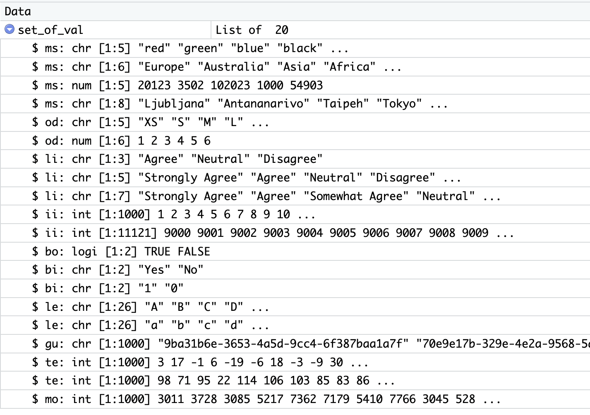

# datasetR: Generating random dataset for R

The `datasetR` helps you generate a random datasets for your R project. It provides a preset random list of values with different data types (interval, ordinal, nominal values). It includes also a function for imputing a NULL, NA or missing values.

## Installing

`datasetR`  package can be installed and downloaded from this Github repository using **devtools** package. More on
[devtools package](https://www.rstudio.com/products/rpackages/devtools/).
 
Installing is done using:

``` r
library(devtools)
install_github("tomaztk/datasetR")
```

## Getting started

Comes prepacked with a main function `dsR()` that will help you generate the dataset. But first, let's create a list with 20 different variable types and a random values.

```         
library(datasetR)
set_of_val <- set_of_val
```
And you will get a starting set of values:



## Data Types

Understand the predefined list of values for constructing the datasets.

**Types** explained:

1. ms: multi-class type of nominal data; all values are equal and no ordering can be done. Available:
	* 	color
	*	continents
	*	imaginary ZIP codes
	*	capital cities
2. od: ordinal data; values can be assigned order and comparison can be created. Available:
	*	clothing size
	*	classes from 1 to 6
3. li: likert scale data; questionnaire type of data and values can be sorted. Available:
	*	three-value scale for expressing opinion
	*	five-value scale for expressing opinion
	*	seven-value scale for expressing opinion
4. bo: boolean data; with values of TRUE and FALSE
5. bi: binary data with two outcomes. Available:
	*	character type of values Yes and No
	* 	integer type of values 0 and 1
6. le: single character values of alphabet letters. Available:
	*	lowercase letters
	* 	uppercase letters
7. gu: alpha-numeric character string of 16 bytes length, v4; known as Globally unique identifier (GUID or UUID)
8. te: numeric data of temperature with no specific unit of measure. Available:
	*	temperature (pref. °C) with range from -20 to 35
	* 	temperature (pref. °C) with range from 1 to 130 (integer type)
9. mo: numeric data of money with no specific unit.

### Generating your random dataset

With the following example, the code will create a dataframe of 100 rows with total of 8 variables. The 8 variables will be type:
1. 3 x multi-class (nominal with multiple classes; characters or numbers)
2. 4 x two-class (nominal with two (binary) class ; characters or numbers)
3. 1 x interval (integer)

The dimensions of the dataset is 8 variables and 100 rows of sampled data.

``` r
library(datasetR)
library(dplyr)

my_dataset <- dsR(vr="ms:3;bi:4;ii:1", nr=100);
```

### Generating your desired 

When you want to create a desired dataset, use the `vr`parameter and construct the string for the values. 
The string is annotated as **type** : _number of variables_ . When stating multiple types, make sure to separated them with semi-colon.

```r
test_data <- dsR(vr="od:1;ms:1;bi:1;ii:1", nr=10);
```

And following statements will generate the dataset of the same dimension.

```r
test_data <- dsR(vr="od:1;od:1", nr=10);
test_data <- dsR(vr="od:2", nr=10);
```


### Adding missing values to your dataset 

When you want to skew your dataset, you can add some missing values to your desired data. By using `addMissingValues` on a desired dataset and desired column, the values will get replaced by `NA` values.
In addition, the parameter `pc` is for percent of values for given dataframe.column that you want to replace. 

```r
my_dataset$ii_1 <- addMissingValues(my_dataset, ii_1, pc = 10)

```

## Community and distribution

You are welcome to submit suggestions and report bugs: https://github.com/tomaztk/datasetR/issues

